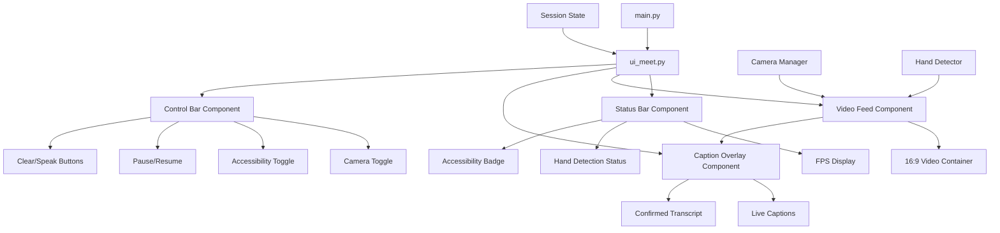
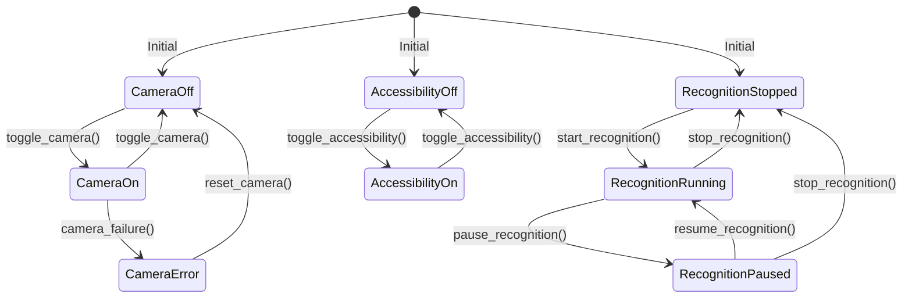

# Design Document: Meet-Style UI for Sign Language Translator

## Overview

This design document specifies the implementation of a Google Meet/Zoom-style user interface for the sign language translator application. The design transforms the existing Streamlit UI into a professional video call interface that judges and users will immediately recognize as a real video communication product.

The core design principle is **familiar video call patterns** - users should feel like they're in a Google Meet or Zoom call, with the added benefit of real-time sign language translation and accessibility features.

## Architecture

### High-Level Architecture



### Component Hierarchy

The Meet-style UI follows a hierarchical component structure:

1. **Page Configuration** - Sets up dark theme and wide layout
2. **CSS Injection** - Injects Meet-style dark theme and component styles
3. **Status Bar** - Top horizontal bar with system metrics
4. **Video Container** - Large central 16:9 video with overlaid captions
5. **Control Bar** - Bottom horizontal bar with circular icon buttons
6. **Advanced Settings** - Collapsible expander for technical controls

### State Management Model

The UI manages three independent state machines:



**State Validation Rules:**
- Recognition can only be RUNNING or PAUSED when camera is ON
- Recognition automatically stops when camera goes to OFF or ERROR
- Accessibility mode is independent and persists across other state changes
- Button interactions are blocked during state transitions to prevent race conditions

## Components and Interfaces

### 1. Page Configuration Component

**Purpose:** Set up Streamlit page for Meet-style experience
**Interface:**
```python
def configure_meet_page() -> None:
    """Configure page with wide layout, dark theme, collapsed sidebar"""
```

**Design Decisions:**
- Wide layout maximizes video real estate (Meet/Zoom pattern)
- Collapsed sidebar keeps focus on video call interface
- Dark theme matches modern video call applications
- Hidden Streamlit branding for clean demo appearance

### 2. CSS Injection Component

**Purpose:** Apply Meet-style dark theme and component styling
**Interface:**
```python
def inject_meet_styles() -> None:
    """Inject comprehensive CSS for Meet-style interface"""
```

**Key Style Categories:**
- **Global Reset:** Remove Streamlit padding for full-screen experience
- **Dark Theme:** #202124 background, high contrast text
- **Video Container:** 16:9 aspect ratio, rounded corners, shadow
- **Caption Overlay:** Absolute positioning, gradient background, text shadow
- **Control Bar:** Circular buttons, hover effects, active states
- **Accessibility Mode:** Purple highlights and special styling

### 3. Status Bar Component

**Purpose:** Display real-time system metrics and status
**Interface:**
```python
def render_status_bar(
    fps: float,
    hand_detected: bool,
    accessibility_mode: bool,
    system_status: str,
) -> None:
```

**Layout:** Horizontal flex container with left-aligned metrics and right-aligned accessibility badge

**Metrics Displayed:**
- FPS with color coding (green ≥15fps, yellow <15fps)
- Hand detection status with icons
- System status text
- Accessibility mode badge (when active)

### 4. Video Feed Component

**Purpose:** Display large central video with overlaid captions
**Interface:**
```python
def render_video_with_captions(
    frame: Optional[np.ndarray],
    live_caption: str,
    confirmed_caption: str,
    accessibility_mode: bool,
    camera_error: Optional[str] = None,
) -> None:
```

**Design Decisions:**
- 16:9 aspect ratio enforced via CSS aspect-ratio property
- Video fills container with object-fit: contain to prevent distortion
- Error overlay shows graceful degradation when camera fails
- Caption overlay uses absolute positioning over video bottom
- Accessibility mode adds purple tint to caption background

### 5. Caption Overlay Component

**Purpose:** Display live captions and confirmed transcript over video
**Styling:**
- Gradient background from opaque black to transparent
- Large white text (1.5rem) with text shadow for readability
- Smaller gray text for confirmed transcript
- Purple tint when accessibility mode is active
- Fade-in animation for smooth text updates

### 6. Control Bar Component

**Purpose:** Provide familiar video call controls
**Interface:**
```python
def render_control_bar(
    is_running: bool,
    is_paused: bool,
    accessibility_mode: bool,
    has_text: bool,
) -> Dict[str, bool]:
```

**Button Layout (8 columns):**
1. Microphone (placeholder)
2. Camera toggle
3. Accessibility mode toggle
4. Pause/Resume recognition
5. Clear captions
6. Speak captions
7. Settings (placeholder)
8. More options (placeholder)

**Button Design:**
- Circular shape (56px diameter) for touch-friendly interaction
- Icon-based with text labels below
- Hover effects with scale and color changes
- Active states for toggle buttons
- Disabled states when functionality unavailable

### 7. Advanced Settings Component

**Purpose:** Hide technical controls in collapsible expander
**Interface:**
```python
def render_advanced_settings() -> None:
```

**Settings Categories:**
- Gesture Recognition (smoothing, confidence, hold frames)
- Display Options (debug overlay, landmarks)
- TTS Configuration (speed, voice)

**Phase 1 Constraint:** Advanced Settings are non-blocking and may reuse existing controls without visual redesign in Phase 1. This prevents scope creep and maintains focus on core Meet-style UI implementation.

## Data Models

### UI State Model

```python
@dataclass
class MeetUIState:
    # Camera state
    camera_active: bool = False
    camera_error: Optional[str] = None
    
    # Recognition state  
    recognition_running: bool = False
    recognition_paused: bool = False
    
    # Accessibility state
    accessibility_mode: bool = True
    
    # Display state
    current_fps: float = 0.0
    hand_detected: bool = False
    system_status: str = "Stopped"
    
    # Caption state
    live_caption: str = ""
    confirmed_caption: str = ""
    has_text: bool = False
    
    # Settings state
    smoothing_window: int = 5
    confidence_threshold: float = 0.58
    tts_speed: float = 1.0
    hold_frames: int = 8
    show_debug: bool = False
    show_landmarks: bool = True
```

### Button Action Model

```python
@dataclass
class ControlActions:
    camera_toggle: bool = False
    accessibility_toggle: bool = False
    pause_toggle: bool = False
    clear: bool = False
    speak: bool = False
```

## UI Invariants

*UI Invariants are characteristics that should hold true across all valid executions of the Meet-style interface. These serve as formal statements about what the UI should do consistently.*

Based on the requirements analysis, the following invariants capture the most critical UI behaviors:

**Invariant 1: Meet-style layout structure**
*For any* UI render, the Meet_UI should display a top status bar, central 16:9 video feed, and bottom control bar with all required elements present
**Validates: Requirements 1.1, 1.2, 1.3, 2.5**

**Invariant 2: Video feed aspect ratio consistency**
*For any* screen size or viewport dimensions, the Video_Feed should maintain a 16:9 aspect ratio
**Validates: Requirements 2.1**

**Invariant 3: Camera integration preservation**
*For any* camera frame provided by Camera_Manager, the Meet_UI should display it without modifying camera logic or breaking existing functionality
**Validates: Requirements 2.2, 9.1, 9.2, 9.3, 9.4, 9.5**

**Invariant 4: Error handling graceful degradation**
*For any* camera error or missing frame, the Video_Feed should show appropriate placeholder content with error messages
**Validates: Requirements 2.3**

**Invariant 5: Dark theme color consistency**
*For any* UI element, the Meet_UI should use the specified dark theme colors (#202124 background, #e8eaed text) and hide Streamlit branding
**Validates: Requirements 1.4, 7.1, 7.2, 7.5**

**Invariant 6: Caption overlay positioning and styling**
*For any* caption text (live or confirmed), the Caption_Overlay should be positioned absolutely over the video bottom with correct text styling
**Validates: Requirements 3.1, 3.2, 3.3**

**Invariant 7: Accessibility mode visual distinction**
*For any* UI state, when Accessibility_Mode is active, all accessibility elements (badge, caption highlighting, button styling) should have purple theming
**Validates: Requirements 3.4, 6.1, 6.2, 6.3**

**Invariant 8: Control bar button functionality**
*For any* button interaction, the control bar buttons should trigger correct state changes (camera toggle, pause/resume, clear, speak) and show appropriate active/disabled states
**Validates: Requirements 4.1, 4.3, 4.4, 4.5, 4.6, 4.7, 8.3, 8.4**

**Invariant 9: Status bar metrics display**
*For any* system state, the Status_Bar should display FPS with correct color coding, hand detection status, and system status with appropriate visual indicators
**Validates: Requirements 5.1, 5.2, 5.3, 5.4**

**Invariant 10: State management validation**
*For any* state transition attempt, the Meet_UI should enforce valid state transitions and block invalid ones (e.g., cannot pause recognition when camera is OFF)
**Validates: Requirements 10.1, 10.2, 10.3, 10.4**

**Invariant 11: State persistence across reruns**
*For any* Streamlit rerun or UI update, accessibility mode state should persist and UI updates should not block camera frame rendering
**Validates: Requirements 6.5, 10.5, 11.2**

**Invariant 12: Modular architecture separation**
*For any* UI operation, the Meet_UI module should maintain separation from camera and detection logic while using proper CSS injection for styling
**Validates: Requirements 12.2, 12.3, 12.5**

## UI Rerun Control Strategy

**Critical Technical Risk:** Streamlit reruns the entire script on every interaction, which poses significant risks for video feed stability and user experience.

### Video Rendering Isolation

The Meet-style UI must architect around Streamlit's rerun behavior to prevent video flicker and maintain smooth performance:

**Video Feed Protection:**
- Video rendering must be isolated from non-visual state changes
- Use session_state flags to debounce unnecessary redraws
- Preserve last valid frame during camera errors or state transitions
- Minimize reruns triggered by button clicks through careful state management

**Rerun Minimization Strategy:**
```python
# Avoid rerendering Video_Feed on non-visual state changes
if st.session_state.get('video_needs_update', True):
    render_video_with_captions(...)
    st.session_state.video_needs_update = False

# Use session_state flags to debounce redraws
if st.session_state.get('ui_state_changed', False):
    # Only update UI components that actually changed
    st.session_state.ui_state_changed = False
```

**Frame Preservation:**
- Always maintain `last_valid_frame` in session state
- Display preserved frame during camera initialization or errors
- Use frame buffering to smooth transitions between states

### State Change Isolation

Button interactions must be designed to minimize full-page reruns:

**Debounced State Updates:**
- Group related state changes into single operations
- Use callback patterns to batch UI updates
- Implement state change queuing for rapid button clicks

**Selective Component Updates:**
- Only rerender components affected by specific state changes
- Use conditional rendering based on state change flags
- Preserve expensive computations (video processing) across reruns

## Error Handling

### Camera Error Handling

The Meet-style UI must gracefully handle camera failures without breaking the user experience:

1. **Camera Initialization Failure:** Display error overlay with retry instructions
2. **Frame Read Failure:** Show last valid frame with error message overlay
3. **Camera Disconnection:** Automatically transition to error state and allow recovery
4. **Permission Denied:** Display clear instructions for enabling camera access

### State Transition Error Handling

Invalid state transitions must be blocked with user feedback:

1. **Recognition Control When Camera Off:** Disable pause/resume buttons and show tooltip
2. **Rapid Button Clicks:** Implement debouncing to prevent race conditions
3. **Session State Corruption:** Provide fallback default values for all state variables

### Streamlit Limitation Handling

When Streamlit limitations prevent ideal implementation:

1. **Hover Effects:** Use CSS approximations with :hover pseudo-classes
2. **Animation Limitations:** Provide static alternatives that maintain functionality
3. **Component Rendering:** Fall back to HTML components for complex interactions

## Testing Strategy

### Dual Testing Approach

The testing strategy combines unit tests for specific examples and property-based tests for universal correctness:

**Unit Tests Focus:**
- Specific button click scenarios and state transitions
- Error condition handling (camera failures, invalid states)
- Integration points with existing Camera_Manager and Hand_Detector
- CSS injection and styling verification
- Streamlit component rendering edge cases

**Property-Based Tests Focus:**
- Universal layout properties across different screen sizes
- State management validation across all possible state combinations
- Color and styling consistency across all UI elements
- Caption display behavior across all text input variations
- Button functionality across all possible interaction sequences

**Property Test Configuration:**
- Minimum 100 iterations per property test for thorough coverage
- Each property test references its design document property number
- Tag format: **Feature: meet-style-ui, Property {number}: {property_text}**
- Use Hypothesis for Python property-based testing with Streamlit test framework

**Testing Tools:**
- **Streamlit Testing Framework:** For component rendering and interaction testing
- **Selective Property Testing:** UI invariants will be implemented selectively for critical state and layout invariants due to Streamlit framework constraints
- **Manual UI Verification:** Visual testing for Meet-style appearance and responsive behavior
- **Integration Testing:** Verify camera and detection system integration points

**Test Coverage Requirements:**
- Critical UI invariants (layout structure, state management, accessibility) must have corresponding tests
- Core user flows (camera start/stop, accessibility toggle, caption display) must have unit tests
- Error conditions and edge cases must have dedicated test coverage
- Performance requirements (frame rate, UI responsiveness) must have benchmark verification

**Realistic Testing Scope:** Property-based tests will be implemented selectively for critical state and layout invariants due to Streamlit framework constraints. This ensures focus on deliverable functionality over academic testing completeness.

The combination ensures both concrete bug detection (unit tests) and comprehensive UI validation across the Meet-style interface implementation.